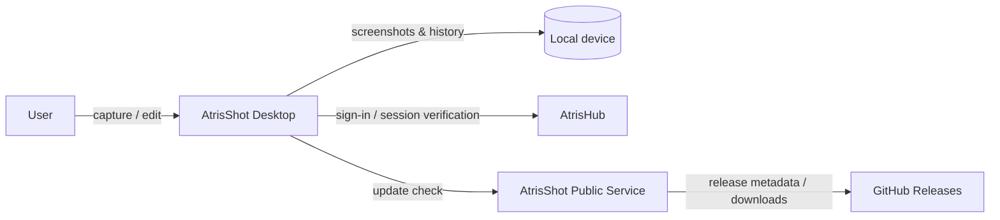

<p align="center">
  
</p>

<h1 align="center">AtrisShot</h1>

<p align="center">
  <strong>Capture, edit, and place screenshots without breaking your flow.</strong>
</p>

<p align="center">
  A fast, local-first desktop screenshot workflow built with Tauri, Rust, Next.js, and TypeScript.
</p>

<p align="center">
  <a href="README.md"><strong>English</strong></a> ·
  <a href="README.tr.md">Türkçe</a> ·
  <a href="https://shot.atrishub.com">Website</a> ·
  <a href="https://atrishub.com">AtrisHub</a>
</p>

---

## What is AtrisShot?

AtrisShot is a desktop screenshot tool designed around one simple idea: taking a screenshot should not interrupt what you are doing.

Use a shortcut to capture the focused window, the current display, or an exact region. Annotate what matters, copy the image to your clipboard, drag or reuse the saved file path, and reopen previous captures from local history.

AtrisShot is part of the Atris ecosystem and uses an AtrisHub account for sign-in. Screenshot files, previews, annotations, history, and saved paths remain local application data by default.

## Highlights

- **Fast capture** — capture a focused window, display, or precisely selected region.
- **Built-in editor** — annotate with pen, rectangle, ellipse, line, arrow, text, and blur tools.
- **Clipboard-first workflow** — copy the result immediately and keep moving.
- **Path-based workflow** — reuse or drag the saved screenshot path into development and productivity tools.
- **Local history** — reopen recent screenshots without uploading them to a cloud gallery.
- **Capture overlay** — keep recent results close at hand after a capture.
- **AtrisHub sign-in** — Free Atris accounts can use AtrisShot; Premium is not required.
- **Signed update flow** — desktop releases are distributed through GitHub Releases and the Tauri updater path.
- **English and Turkish UI** — the product and landing experience support both languages.

## Local-first by design

AtrisShot keeps the screenshot workflow on the device.

| Data / capability | Where it lives |
| --- | --- |
| Screenshots and edited images | Local device |
| Screenshot history and previews | Local app data |
| Save paths and editor state | Local app data |
| Atris account authentication | AtrisHub over HTTPS |
| Remembered native session token | OS-protected credential storage |
| Release packages | GitHub Releases |
| Landing, download routing, updater metadata | AtrisShot public service |

On native builds, remembered session credentials are delegated to platform-protected storage rather than being persisted as plaintext application data. Windows uses DPAPI-backed storage; supported non-Windows builds use the operating-system keyring.

AtrisHub is used for authentication and account/membership verification. This repository intentionally contains only the public AtrisHub origin and the client-side API contract required to sign in; it does **not** contain AtrisHub database credentials, JWT secrets, SSH credentials, or production server access keys.

## How it works



The repository is split so that the desktop capture runtime, public product site, and release service can evolve independently:

- `apps/desktop` — Tauri + Next.js desktop UI and native Rust runtime.
- `apps/landing` — public AtrisShot product/landing experience.
- `services/public-server` — landing delivery, release download routing, and Tauri updater metadata.
- `packages` — shared contracts and reusable workspace packages.
- `scripts` — validation, release, branding, and repository boundary checks.
- `infra/nginx` — reference reverse-proxy configuration for the AtrisShot public service.

AtrisHub itself is a separate service and is not bundled into this repository.

## Supported platforms

| Platform | Status | Distribution |
| --- | --- | --- |
| Windows 10/11 x64 | Supported | Setup executable / MSI release assets |
| Linux x64 | Supported | AppImage / `.deb` release assets |
| macOS | Paused | Packaging will return when Apple signing/notarization is ready |

The current release workflow publishes Windows and Linux targets.

## Download

The product landing page is available at **https://shot.atrishub.com**.

Published desktop builds are delivered through GitHub Releases. The public AtrisShot service provides the user-facing download route and signed Tauri updater metadata; application binaries are release artifacts rather than files served from the AtrisHub application backend.

## Development

### Prerequisites

- Node.js 20+
- npm 10+
- Rust stable toolchain
- Platform-specific Tauri prerequisites for your operating system

For full end-to-end authentication development, AtrisHub runs as a separate service. The default local development contract expects it on `127.0.0.1:3000`.

### Install

```bash
git clone https://github.com/merteren97/AtrisShot.git
cd AtrisShot
npm ci
```

Create your local environment file from the checked-in example. Never commit real credentials or private keys.

```bash
cp .env.example .env
```

PowerShell:

```powershell
Copy-Item .env.example .env
```

### Run the local stack

```bash
npm run dev:local
```

`dev:local` starts the AtrisShot public service on `127.0.0.1:3008` together with the Tauri desktop development flow. The desktop development server uses port `3009`; the landing development server uses `3010` when run separately.

Useful commands:

```bash
npm run dev:landing
npm run dev:public
npm run tauri:dev
npm run typecheck
npm run test:runtime-boundary
npm run test:security-boundary
npm run test:settings
npm run test:release-proxy
npm run validate
```

## Security boundaries

AtrisShot treats public-source hygiene as part of the build and validation process.

- Environment files, private keys, certificates, local screenshots, app data, logs, and release scratch data are excluded from Git.
- Production deployment credentials are consumed through GitHub Actions secrets, not stored in repository files.
- Production updater URLs are built from a configured/canonical trusted origin instead of client-controlled forwarding headers.
- Private release proxy access is limited to assets belonging to the current latest release.
- The production Tauri webview uses a restrictive Content Security Policy.
- Pull-request validation includes dedicated runtime and security-boundary regression checks.
- Dependabot monitors npm, Cargo, and GitHub Actions dependencies.

No software should be treated as having zero security risk. If you plan to deploy a fork, review your own environment variables, reverse proxy, signing keys, release permissions, and dependency state before exposing it publicly.

## Validation

The root validation command checks the TypeScript workspaces, runtime/security boundaries, settings normalization, release proxy behavior, Windows release automation, and production builds:

```bash
npm run validate
```

Native Rust checks are also part of the repository's pull-request validation workflow.

## Contributing

Issues and focused pull requests are welcome. Keep changes scoped, preserve the local-first data boundary, and include regression coverage when changing capture, authentication, updater, native-file, or release behavior.

Before proposing a large architectural change, opening an issue first is recommended so the direction can be discussed without duplicating work.

## License

An explicit open-source license has **not been added yet**. Before the repository is made public as an open-source project, add a `LICENSE` file and update this section with the chosen license.

Public repository visibility by itself does not grant open-source reuse rights.
