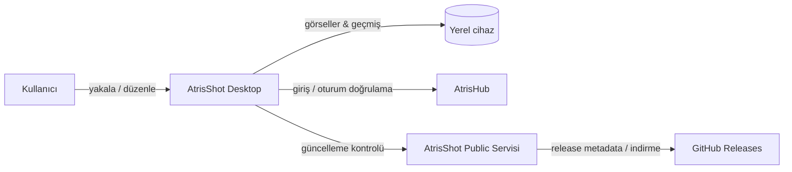

<p align="center">
  
</p>

<h1 align="center">AtrisShot</h1>

<p align="center">
  <strong>Akışını bölmeden ekran görüntüsü yakala, düzenle ve kullan.</strong>
</p>

<p align="center">
  Tauri, Rust, Next.js ve TypeScript ile geliştirilen hızlı ve local-first masaüstü ekran görüntüsü akışı.
</p>

<p align="center">
  <a href="README.md">English</a> ·
  <a href="README.tr.md"><strong>Türkçe</strong></a> ·
  <a href="https://shot.atrishub.com">Web Sitesi</a> ·
  <a href="https://atrishub.com">AtrisHub</a>
</p>

---

## AtrisShot nedir?

AtrisShot, tek bir fikir etrafında tasarlanmış masaüstü ekran görüntüsü aracıdır: ekran görüntüsü almak yaptığın işi kesintiye uğratmamalı.

Bir kısayol ile odaklı pencereyi, mevcut ekranı veya tam olarak seçtiğin bir bölgeyi yakalayabilirsin. Önemli alanları işaretleyebilir, görseli panoya kopyalayabilir, kaydedilen dosya yolunu sürükleyip yeniden kullanabilir ve önceki yakalamaları yerel geçmişten tekrar açabilirsin.

AtrisShot, Atris ekosisteminin bir parçasıdır ve giriş için AtrisHub hesabı kullanır. Ekran görüntüleri, önizlemeler, anotasyonlar, geçmiş ve kayıt yolları varsayılan olarak cihazındaki yerel uygulama verisi olarak kalır.

## Öne çıkan özellikler

- **Hızlı yakalama** — odaklı pencereyi, ekranı veya hassas şekilde seçilen bir bölgeyi yakala.
- **Yerleşik düzenleyici** — kalem, dikdörtgen, elips, çizgi, ok, metin ve blur araçlarını kullan.
- **Pano odaklı akış** — sonucu anında kopyala ve çalışmaya devam et.
- **Dosya yolu akışı** — kaydedilen ekran görüntüsünün path bilgisini geliştirme ve üretkenlik araçlarında yeniden kullan veya sürükle.
- **Yerel geçmiş** — görüntüleri bir bulut galerisine yüklemeden son ekran görüntülerini tekrar aç.
- **Yakalama overlay'i** — son sonuçları yakalama sonrasında kolay erişilebilir tut.
- **AtrisHub girişi** — Free Atris hesapları AtrisShot'ı kullanabilir; Premium zorunlu değildir.
- **İmzalı güncelleme akışı** — masaüstü sürümleri GitHub Releases ve Tauri updater yolu üzerinden dağıtılır.
- **Türkçe ve İngilizce arayüz** — ürün ve landing deneyimi iki dili de destekler.

## Local-first tasarım

AtrisShot ekran görüntüsü akışını cihaz üzerinde tutar.

| Veri / yetenek | Nerede tutulur? |
| --- | --- |
| Ekran görüntüleri ve düzenlenen görseller | Yerel cihaz |
| Ekran görüntüsü geçmişi ve önizlemeler | Yerel uygulama verisi |
| Kayıt yolları ve editör durumu | Yerel uygulama verisi |
| Atris hesabı doğrulaması | HTTPS üzerinden AtrisHub |
| Hatırlanan native oturum token'ı | İşletim sistemi korumalı credential storage |
| Release paketleri | GitHub Releases |
| Landing, indirme yönlendirmesi, updater metadata | AtrisShot public servisi |

Native build'lerde hatırlanan oturum bilgileri düz metin uygulama verisi olarak saklanmak yerine platformun korumalı credential depolamasına bırakılır. Windows tarafında DPAPI tabanlı saklama, desteklenen Windows dışı sistemlerde ise işletim sistemi keyring'i kullanılır.

AtrisHub yalnızca kimlik doğrulama ile hesap/üyelik doğrulaması için kullanılır. Bu repository bilinçli olarak yalnızca public AtrisHub origin bilgisini ve giriş için gereken istemci API contract'ını içerir; AtrisHub veritabanı şifreleri, JWT secret'ları, SSH bilgileri veya production sunucu erişim anahtarları bu repository'de bulunmaz.

## Nasıl çalışır?



Repository; masaüstü yakalama runtime'ı, public ürün sitesi ve release servisinin birbirinden bağımsız geliştirilebilmesi için ayrılmıştır:

- `apps/desktop` — Tauri + Next.js masaüstü arayüzü ve native Rust runtime.
- `apps/landing` — public AtrisShot ürün/landing deneyimi.
- `services/public-server` — landing sunumu, release indirme yönlendirmesi ve Tauri updater metadata servisi.
- `packages` — ortak contract'lar ve yeniden kullanılabilir workspace paketleri.
- `scripts` — validation, release, branding ve repository boundary kontrolleri.

AtrisHub'ın kendisi ayrı bir servistir ve bu repository içine dahil değildir. Production altyapısı ve deployment yapılandırması bu public source tree yerine ayrı private Atris operasyonlarında tutulur.

## Desteklenen platformlar

| Platform | Durum | Dağıtım |
| --- | --- | --- |
| Windows 10/11 x64 | Destekleniyor | Setup executable / MSI release asset'leri |
| Linux x64 | Destekleniyor | AppImage / `.deb` release asset'leri |
| macOS | Beklemede | Apple signing/notarization hazır olduğunda paketleme tekrar eklenecek |

Mevcut release workflow'u Windows ve Linux hedeflerini yayınlar.

## İndir

Ürün landing sayfası **https://shot.atrishub.com** adresindedir.

Yayınlanan masaüstü build'leri GitHub Releases üzerinden dağıtılır. Public AtrisShot servisi kullanıcıya dönük indirme yolunu ve imzalı Tauri updater metadata'sını sağlar; uygulama binary'leri AtrisHub uygulama backend'inden sunulan dosyalar değil, release asset'leridir.

## Geliştirme

### Gereksinimler

- Node.js 20+
- npm 10+
- Rust stable toolchain
- İşletim sistemine uygun Tauri geliştirme gereksinimleri

Tam uçtan uca authentication geliştirmesi için AtrisHub ayrı bir servis olarak çalışır. Varsayılan local development contract'ı AtrisHub'ı `127.0.0.1:3000` üzerinde bekler.

### Kurulum

```bash
git clone https://github.com/merteren97/AtrisShot.git
cd AtrisShot
npm ci
```

Repository'deki örnek dosyadan yerel environment dosyanı oluştur. Gerçek credential veya private key'leri hiçbir zaman commit etme.

```bash
cp .env.example .env
```

PowerShell:

```powershell
Copy-Item .env.example .env
```

### Local stack'i çalıştır

```bash
npm run dev:local
```

`dev:local`, AtrisShot public servisini `127.0.0.1:3008` üzerinde ve Tauri masaüstü geliştirme akışını birlikte başlatır. Desktop development server `3009`, ayrı çalıştırıldığında landing development server ise `3010` portunu kullanır.

Faydalı komutlar:

```bash
npm run dev:landing
npm run dev:public
npm run tauri:dev
npm run typecheck
npm run test:runtime-boundary
npm run test:security-boundary
npm run test:settings
npm run test:release-proxy
npm run validate
```

## Güvenlik sınırları

AtrisShot public-source hijyenini build ve validation sürecinin bir parçası olarak ele alır.

- Environment dosyaları, private key'ler, sertifikalar, yerel ekran görüntüleri, uygulama verileri, loglar ve release scratch verileri Git dışında tutulur.
- Production altyapısı, deployment yapılandırması ve sunucu erişim credential'ları ayrı private Atris operasyonlarında tutulur ve bu repository'nin parçası değildir.
- Production updater URL'leri istemci tarafından kontrol edilebilen forwarding header'ları yerine yapılandırılmış/canonical güvenilir origin üzerinden oluşturulur.
- Private release proxy erişimi mevcut latest release'e ait asset'lerle sınırlandırılır.
- Production Tauri webview kısıtlayıcı bir Content Security Policy kullanır.
- Pull request validation akışı özel runtime ve security-boundary regression kontrollerini içerir.
- Dependabot npm, Cargo ve GitHub Actions bağımlılıklarını izler.

Hiçbir yazılım için sıfır güvenlik riski garantisi verilmemelidir. Bir fork'u deploy edeceksen environment variable'larını, reverse proxy yapılandırmanı, signing key'lerini, release izinlerini ve dependency durumunu public'e açmadan önce ayrıca incele.

## Doğrulama

Root validation komutu TypeScript workspace'lerini, runtime/security sınırlarını, settings normalization'ı, release proxy davranışını, Windows release otomasyonunu ve production build'lerini kontrol eder:

```bash
npm run validate
```

Native Rust kontrolleri de repository'nin pull-request validation workflow'una dahildir.

## Katkıda bulunma

Issue'lar ve kapsamı net pull request'ler memnuniyetle karşılanır. Değişiklikleri odaklı tut; local-first veri sınırını koru ve capture, authentication, updater, native dosya erişimi veya release davranışını değiştirirken regression coverage ekle.

Büyük bir mimari değişiklik önermeden önce aynı işin iki kez yapılmasını önlemek ve yönü konuşmak için bir issue açılması önerilir.

## Lisans

AtrisShot, **Apache License 2.0** altında lisanslanan açık kaynaklı bir yazılımdır. Lisans koşullarının tamamı için [`LICENSE`](LICENSE) dosyasına bakabilirsin.

Apache License kaynak kodu kapsar; AtrisShot veya AtrisHub adları, logoları ve diğer marka unsurları için trademark kullanım hakkı vermez.